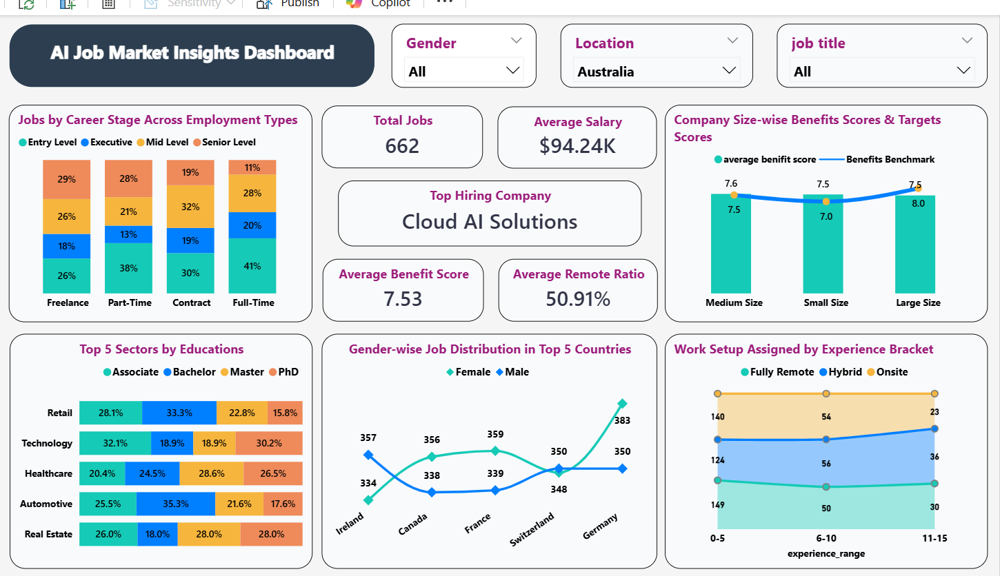

# 🤖 Power BI AI Job Market Insights Dashboard

This repository showcases a Power BI dashboard that provides detailed insights into the AI job market, focusing on career stages, work setups, education demand, gender-based distribution, and benefits by company size.

This dashboard is designed to help hiring teams, analysts, and decision-makers understand job trends, optimize hiring strategy, and promote diversity across geographies and industries.

---

## 📄 Files Included

- `NEW_AI_JOBS_INSIGHTS.pdf` – PDF report with visual-wise explanations, questions, and insights
- `302_pl.png` – Dashboard screenshot (AI Job Market dashboard)

---

## 🖼️ Dashboard Preview

---

## 🔍 Key Insights from the Dashboard

- 🧑‍💼 **Job Levels by Employment Type**: Track how full-time, part-time, freelance, and contract roles vary across career stages
- 🎓 **Industry Hiring by Education Level**: Identify which industries prefer candidates with associate, bachelor, master, or PhD degrees
- 🏢 **Company Size vs Benefit Score**: Compare benefit performance across small, medium, and large organizations
- 🏠 **Work Setup by Experience**: Analyze how remote, onsite, and hybrid setups are distributed by experience level
- 🌎 **Gender-wise Job Distribution by Country**: Understand diversity trends in hiring across top countries
- 📊 **Top Summary KPIs**: Total jobs, average salary, top hiring company, benefit score, remote work %

---

## 📌 Use Case

This dashboard is ideal for:
- Talent acquisition teams analyzing role demand
- HR professionals promoting workplace diversity
- Market researchers exploring trends in AI hiring
- Decision-makers planning future workforce strategy

---

## 📜 License

This project is licensed under the [MIT License](LICENSE).  
**Note:** The `.pbix` file is not included to protect source visuals and maintain confidentiality.

---

## 🙌 Author

**[Vikrant Ghale]**  

